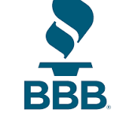

# **Better Business Bureau Database Project**
#### **A partnership project with MNSU**

## **Client: Better Business Bureau (BBB)**
[The Better Business Bureau (BBB)](https://www.bbb.org/) helps consumers find trustworthy businesses by advancing trust between businesses and consumers. It sets standards for marketplace trust, supports good business practices, celebrates marketplace role models and calls out shady business practices and scams.

## **Project Description**
Build and improve upon a project built started by a previous team which attempted to find or construct missing URLs for websites based in Minnesota,through extracting email domains, using regex and running automated google searches on business names.

## **Objective**

## **Deliverables and Priorities**

| Deliverables | Type of Work | Resources | Tech Skills | Priority |
| --- | --- | --- | --- | --- |
| Intergration of scripts into development environment | Scripts that will likely live on a server and be called by other data tools | Sandbox database and development environment to store scripts, data and metadata | Python | High |
| Consolidation and streamlining of scripts | Invoke library functions from a single script  | Previous teams' code | Python | High |
| Improvements and updates to prediction model | A new model to test the validity of the URL | Database tables and structures | Python | High |
| Improvements to URL generation | Leverage google searches to find the correct URLS for businesses | BBB business data tables, google search | ML, Python | Medium|
| Improvements to web scraping | Scraping websites to fit into broad pattern recognition or markers withing the site's HTML | BBB business data tables, relevant python packages | Python, googlesearch, data engineering | Medium |

